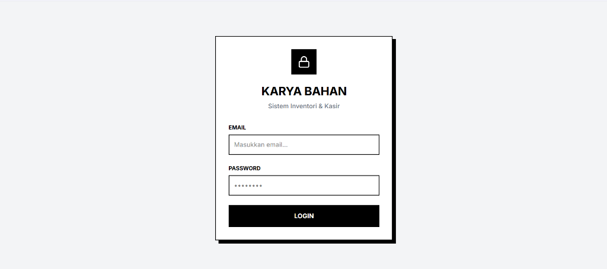
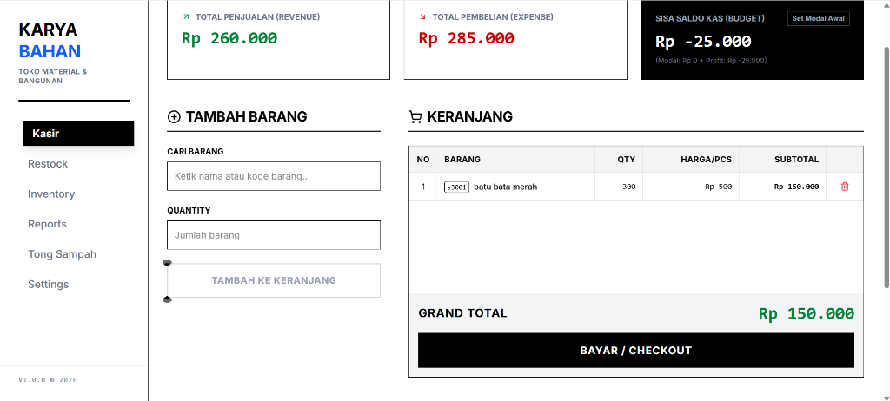
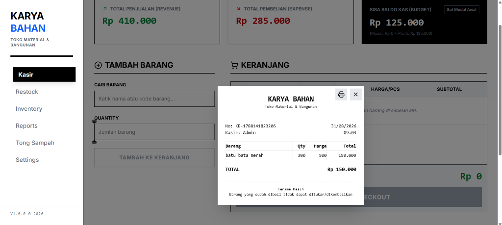
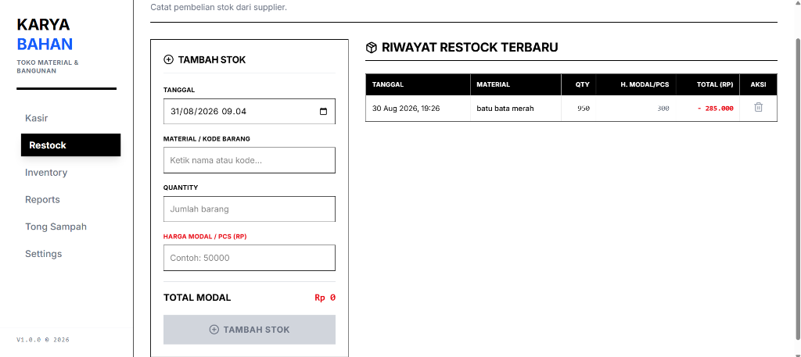
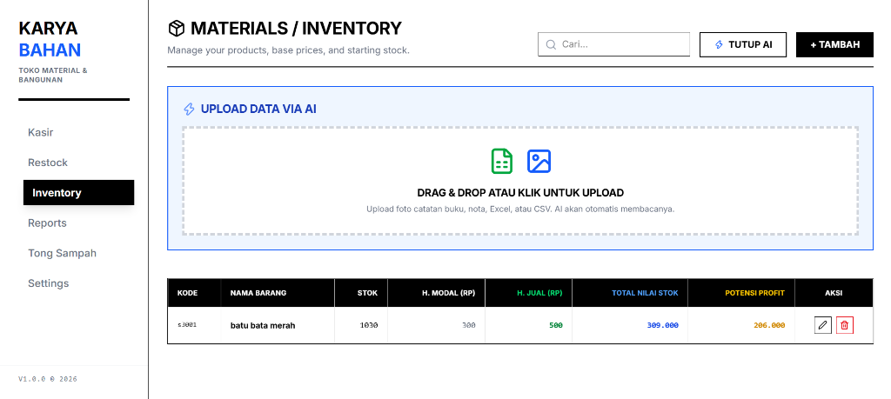
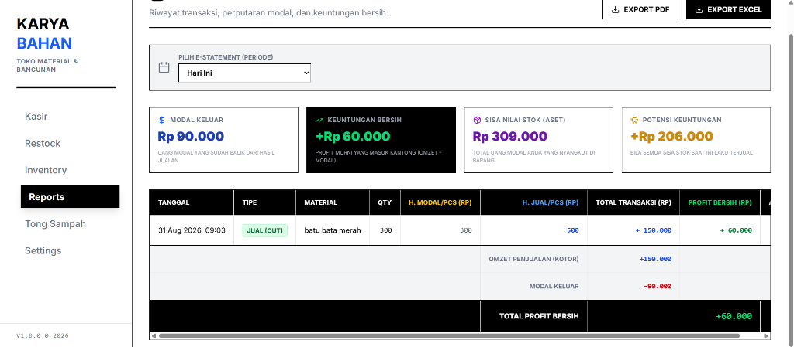
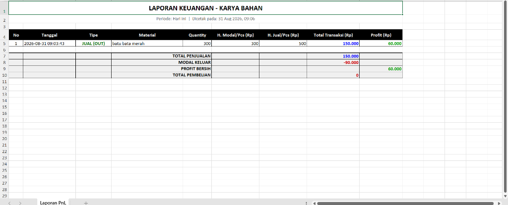
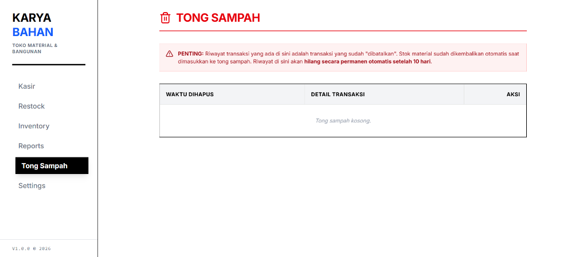

# BUKU PANDUAN APLIKASI KASIR & INVENTORY
**Sistem Cerdas untuk Manajemen Toko (Bysca Parfume & Karya Bahan)**

---

## 1. Pengenalan Aplikasi
Aplikasi ini adalah sistem kasir (Point of Sale) dan manajemen stok barang modern. Berbeda dengan aplikasi kasir biasa, sistem ini dibuat **khusus (custom)** untuk menyesuaikan alur kerja toko Anda. Aplikasi ini berbasis *Cloud*, artinya Anda bisa mengakses toko, mengecek stok, dan melihat laporan keuntungan dari mana saja (Laptop, PC, atau HP) selama ada internet, tanpa perlu takut data hilang jika komputer toko rusak.

*Sistem dilengkapi keamanan Login (Email & Password) sehingga data keuangan toko tidak bisa diakses oleh orang sembarangan.*

---

## 2. Fitur Kasir & Cetak Struk (Penjualan)
Halaman Kasir dirancang agar pelayan toko bisa bekerja dengan sangat cepat. 

**Keunggulan Sistem Kasir:**
*   **Sistem Keranjang:** Kasir bisa memasukkan banyak barang sekaligus sebelum menekan tombol "Bayar".
*   **Pencarian Pintar:** Ketik nama atau kode barang, tekan tombol panah di *keyboard*, dan tekan *Enter*. Sangat cepat tanpa harus selalu menggunakan *mouse*.
*   **Perlindungan Keuntungan Masa Lalu (Anti-Kacau):** Jika hari ini Anda menaikkan harga jual barang, laporan keuntungan bulan lalu **TIDAK AKAN** ikut berubah. Sistem dengan cerdas "mengunci" harga modal dan harga jual pada detik transaksi tersebut terjadi (seperti mencetak nota permanen di sistem).

*Setelah klik Bayar, sistem akan memunculkan Struk/Faktur. Anda bisa langsung mencetaknya menggunakan printer struk kecil (Thermal) maupun printer biasa.*

---

## 3. Fitur Restock / Kulakan (Pembelian Stok)
Halaman ini khusus digunakan ketika toko belanja stok barang baru dari *supplier*.

**Cara Kerja:**
1. Kasir mencari nama barang yang dibeli.
2. Masukkan jumlah (Quantity) barang yang masuk.
3. Masukkan "Harga Modal per Pcs" (harga beli dari supplier).
4. Klik Tambah Stok. 
5. Otomatis, stok di gudang akan bertambah dan uang pembelanjaan ini akan tercatat sebagai "Pengeluaran/Modal Keluar" di Laporan Keuangan.

---

## 4. Manajemen Inventory / Stok Barang
Pusat kendali barang Anda. Di sini Anda bisa melihat sisa stok, mengubah harga modal dasar, dan mengubah harga jual ke pelanggan.

**Fitur Canggih "AI Smart Import":**
Jika Anda punya catatan barang lama berbentuk file Excel, PDF, atau bahkan **Foto Kertas Tulisan Tangan**, Anda cukup klik area "Drag & Drop" atau klik "AI Import". Sistem Kecerdasan Buatan (AI) akan membaca foto/file tersebut dan memasukkannya ke dalam tabel secara otomatis tanpa perlu diketik ulang satu per satu!

---

## 5. Laporan Keuangan (Reports) & Pembukuan Otomatis
Sistem ini secara otomatis memisahkan uang hasil penjualan dan uang untuk belanja stok.

**Yang bisa Anda pantau secara langsung:**
*   **Modal Keluar:** Uang yang digunakan untuk belanja supplier.
*   **Keuntungan Bersih (Profit):** Uang untung murni yang masuk ke kantong.
*   **Sisa Nilai Stok (Aset):** Total nilai uang Anda yang saat ini "mengendap" dalam bentuk barang di toko.
*   **Potensi Keuntungan:** Prediksi keuntungan jika semua sisa barang di toko laku terjual.

*Anda bisa mengekspor laporan bulan tertentu ke bentuk file Excel yang rapi (lengkap dengan warna dan tabel otomatis) untuk disimpan di komputer, di-print, atau direkap akhir tahun.*

---

## 6. Fitur Keamanan: Tong Sampah (Anti Hapus Permanen)
Untuk mencegah kasir melakukan kecurangan atau salah ketik, sistem ini dilengkapi fitur pengaman.

Jika sebuah transaksi dibatalkan atau dihapus di halaman Kasir/Laporan, data tersebut **tidak akan langsung hilang**. Data akan masuk ke menu "Tong Sampah". 
*   **Stok Otomatis Kembali:** Stok barang dari transaksi yang batal akan otomatis dikembalikan ke gudang.
*   **Jejak Audit:** Pemilik toko bisa melihat riwayat transaksi apa saja yang dibatalkan oleh kasir sebelum data tersebut benar-benar terhapus permanen oleh sistem setelah 10 hari.

---

## 7. Rencana Pengembangan (Opsional Ke Depan)
Jika bisnis Anda semakin besar, sistem ini siap ditambahkan fitur lanjutan seperti:
1.  **Backup Otomatis ke Google Sheets:** Mengirim setiap nota kasir langsung ke akun Google Drive pemilik secara *real-time* (sebagai buku besar lapis ganda).
2.  **Sistem Akun Multi-Pegawai:** Memisahkan hak akses (Pemilik bisa ubah harga & lihat laporan rahasia, sementara Kasir hanya bisa jualan).
3.  **Grafik Analitik Lanjutan:** Menampilkan grafik barang apa yang paling laris bulan ini.

